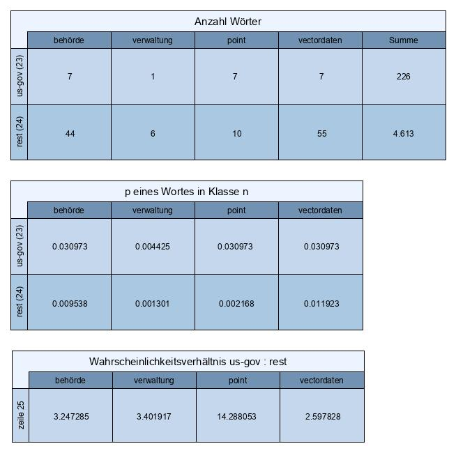

#

Text-Mining: Klassifikation von Metadaten-Dokumenten zu INSPIRE-Themen
======================================================================

## Inhalt
* [Einleitung](#einleitung)
* [Text-Klassifikation in Python](#text-klassifikation-in-python)
* [Exkurs Naive Bayes](#exkurs-naive-bayes)
* [Optimierung der Text-Klassifikation](#optimierung-der-text-klassifikation)
* [Summary](#summary)


## Einleitung
Die öffentlichen Einrichtungen in Europa sind durch EU-Richtlinie dazu verpflichtet, Geodaten zu insgesamt 32 INSPIRE-Themen bereitzustellen. Die Feststellung ob ein Geodatensatz für INSPIRE relevant ist, hat sich zumindest in Deutschland zu einem wahren bürokratischen Akt entwickelt. Basierend auf Excel-Tabellen und einem Top-Down Ansatz.

Wir wollen hier der Frage nachgehen, inwieweit sich Machine Learning für die Klassifikation von Metadaten-Dokumenten zu INSPIRE-Themen eignet. Dazu wären zwei Bedingungen vorauszusetzen. Erstens müssten alle Akteure sämtliche Geodatensätze mit Metadaten beschreiben und zweitens müssten sie gemeinsam einen Trainings-Datensatz aufbauen.

Diese Bedingungen sind nicht gegeben. Deshalb habe ich exemplarisch einen eigenen Trainings-Datensatz erstellt. Dieser ist allerdings sehr klein. Die [Trainingsdaten](data/inspire/inspire-train) enthalten Metadaten-Dokumente zu allen 72 Datensätzen, die in Hamburg bereits in das INSPIRE Zielschema transformiert wurden. Die [Testdaten](data/ inspire/inspire-test) sind frei erfunden und enthalten nur 8 Dokumente. Verteilt sind die Metadaten-Dokumente auf 23 INSPIRE-Themen und einer not-INSPIRE Klasse, die aber in der Stichprobe deutlich unterrepräsentiert ist.


## Text-Klassifikation in Python
Technisch werden wir die Aufgabe mit dem Machine Learning Package sklearn in Python angehen. Der gesamte Quellcode ist in einem Jupyter Notebook [IPYNB-File](src/pub_inspire.ipynb) gespeichert. Zunächst importieren wir die benötigten Python packages.
```
import numpy as np
import pandas as pd
from sklearn.datasets import load_files
from sklearn.feature_extraction.text import CountVectorizer
from sklearn.feature_extraction.text import TfidfTransformer
from sklearn.naive_bayes import MultinomialNB
from sklearn.pipeline import Pipeline
from sklearn.linear_model import SGDClassifier
from sklearn import metrics
from sklearn.model_selection import GridSearchCV
```
Dann lesen wir die [Trainingsdaten](data/inspire/inspire-train) und die [Testdaten](data/ inspire/inspire-test) ein.
```
meta_train = load_files(r'D:\ML_TextMining\data_inspire\inspire-train', shuffle=True, encoding='utf-8', random_state=42)
meta_test = load_files(r'D:\ML_TextMining\data_inspire\inspire-test', shuffle=True, encoding='utf-8', random_state=42)

X_train = meta_train.data
y_train = meta_train.target
X_test = meta_test.data
y_test = meta_test.target
```
Daran sollte sich ein Preprocessing unserer Text-Dokumente anschließen. Dazu zählen das Stemming (Wortherabsetzung), der Einsatz von Thesauren sowie die Termeliminierung (Stoppwörter). Das ist eine Wissenschaft für sich, für die z.B. das [Natural Language Toolkit](http://www.nltk.org/) eine Schnittstelle bietet. Wir wollen uns in unserem Experiment mit der Eliminierung von Stoppwörtern begnügen. Dazu lesen wir die deutsche Stoppwortliste [german_stopwords_plain](https://github.com/solariz/german_stopwords) ein.
```
df = pd.read_csv("german_stopwords_plain.txt")
stopwords = df.loc[:,'#german_stopwords_plain.txt'].to_list()
```
Machine Learning Klassifikatoren können nicht direkt auf Texten arbeiten. Die Texte müssen daher zunächst vektorisiert werden. Dazu wird jedes Wort als Feature betrachtet und seine Häufigkeit in einem Textdokument gezählt. In unserem Fall erhalten wir ein Array aus 72 Samples (Dokumenten) und 1.677 Features (Wörtern). Alle Stoppwörter aus der Liste wurden dabei eliminiert. Die Auswirkung auf die Klassifikationsgüte ist in unserem Fall allerdings vernachlässigbar gering.
```
count_vect = CountVectorizer(stop_words=stopwords)
X_train_counts = count_vect.fit_transform(X_train)

print('CountVectorizer Shape:', X_train_counts.shape)
```
Jetzt kommen wir zur Klassifikation, die wir mit einem Naive Bayes Algorithmus durchführen werden. Dabei erfolgt eine Zuordnung der Dokumente nach Wahrscheinlichkeiten. Das Prinzip sehen wir uns später an einem einfachen Beispiel etwas genauer an. Zunächst trainieren wir den MultinomialNB Klassifikator mit den Trainingsdaten.
```
clf = MultinomialNB().fit(X_train_counts, y_train)
```
Nehmen uns die Testdaten, die wir ebenfalls vektorisieren und anschließend mit dem MultinomialNB Klassifikator den 24 Klassen zuordnen lassen. Und sehen uns die Ergebnisse an. Die Testdaten wurden nur zu 50% richtig klassifiziert (Trainingsdaten 92%). Die Zuordnungswahrscheinlichkeiten schreiben wir der Übersichtlichkeit halber in ein csv-file.
```
X_test_counts = count_vect.transform(X_test)
predicted = clf.predict(X_test_counts)

print('Test-Label True:', y_test)
print('Test-Label Pred:', predicted)
print('Test Score:', clf.score(X_test_counts, y_test))
print('Train Score:', clf.score(X_train_counts, y_train))

print('\nZuordnung Test-Dokumente:')
category = meta_test.target_names
for doc, category in zip(X_test, predicted):
    print('%r => %s' % (doc, meta_test.target_names[category]), '\n')

#probability test-documents for class:
df_proba = pd.DataFrame(clf.predict_proba(X_test_counts))
df_proba.to_csv(r"D:\ML_TextMining\probability_nb_document.csv", sep=';', index=True)

print('\nKlassifikations Report Testdaten:')
print(metrics.classification_report(y_test, predicted))
print('\nKlassifikations Report Trainingsdaten:')
print(metrics.classification_report(y_train, clf.predict(X_train_counts)))
```
* Das Geologie Dokument wurde mit 100% Wahrscheinlichkeit der **richtigen Klasse ge** zugeordnet.
* Das Dokument Spielplaetze wurde mit 60% Wahrscheinlichkeit der falschen Klasse us-gov und mit 35% der richtigen Klasse not-inspire zugeordnet.
* Das Wasserkraft Dokument wurde mit 54% bzw. 45% Wahrscheinlichkeit den falschen Klassen ps bzw. not-inspire zugeordnet.
* Das Dokument Behoerde wurde mit 82% Wahrscheinlichkeit der **richtigen Klasse us-gov** zugeordnet.
* Das Dokument Ampel wurde mit 62% Wahrscheinlichkeit der **richtigen Klasse not-inspire** zugeordnet.
* Das Dokument Parkraumsensor wurde mit 56% Wahrscheinlichkeit der **richtigen Klasse not-inspire** zugeordnet.
* Das Dokument Geothermie wurde mit 100% Wahrscheinlichkeit der falschen Klasse er-c zugeordnet. *Das Dokument unterscheidet sich von den Geothermie Trainingsdokumenten (Klasse er-c) nur durch das Wort Vectordaten (statt Rasterdaten).*
* Das Dokument Sportplatz wurde mit 76% Wahrscheinlichkeit der falschen Klasse us-gov und mit 23% der richtigen Klasse not-inspire zugeordnet.


## Exkurs Naive Bayes
Nun wollen wir nochmal auf den Naive Bayes Klassifikator zurückkommen. Dabei werden wir das Bayes-Theorem an einem Beispiel anwenden, so wie es im Onlinekurs [Elements of AI](https://course.elementsofai.com/de/3/3) gezeigt wird. Dazu nehmen wir das Testdokument 'behoerde' und gehen vereinfacht von 2 Klassen aus, der Klasse us-gov und einer Restklasse, zu der wir die übrigen 23 Klassen zusammenfassen. Und wir betrachten aus dem Testdokument nur die 4 Wörter 'behörde', 'verwaltung', 'point', 'vectordaten'.
```
#Exkurs Wahrscheinlichkeiten am Beispiel Test-Dokument 'Behoerden' der Klasse us-gov:
dfc = pd.DataFrame(clf.feature_count_, columns=count_vect.get_feature_names())
dfc.loc[:,'Summe'] = dfc.sum(axis=1)
dfc.loc[24] = dfc.loc[dfc.index.difference([23])].sum(axis=0)
dfd = dfc.loc[[23,24],['behörde','verwaltung','point','vectordaten','Summe']]

dfd.loc[:,'p_behörde'] = dfd.loc[:,'behörde'] / dfd.loc[:,'Summe']
dfd.loc[:,'p_verwaltung'] = dfd.loc[:,'verwaltung'] / dfd.loc[:,'Summe']
dfd.loc[:,'p_point'] = dfd.loc[:,'point'] / dfd.loc[:,'Summe']
dfd.loc[:,'p_vectordaten'] = dfd.loc[:,'vectordaten'] / dfd.loc[:,'Summe']

dfd.loc[25,'p_behörde'] = dfd.loc[23,'p_behörde'] / dfd.loc[24,'p_behörde']
dfd.loc[25,'p_verwaltung'] = dfd.loc[23,'p_verwaltung'] / dfd.loc[24,'p_verwaltung']
dfd.loc[25,'p_point'] = dfd.loc[23,'p_point'] / dfd.loc[24,'p_point']
dfd.loc[25,'p_vectordaten'] = dfd.loc[23,'p_vectordaten'] / dfd.loc[24,'p_vectordaten']

r = 7/165 * dfd.loc[25,'p_behörde'] * dfd.loc[25,'p_verwaltung'] * dfd.loc[25,'p_point'] * dfd.loc[25,'p_vectordaten']

print('\nWahrscheinlichkeitsverhaeltnis us-gov : rest [Zeile 25]\n', dfd)
print('\nChance us-gov pos:', r)
print('proba us-gov pos:', r/(r+1))
```
Zunächst ermitteln wir die Häufigkeit der 4 Wörter in den beiden Klassen des Trainings-Datensatzes und bilden die Summe je Klasse (vgl. Tabelle 1). Ermitteln die relative Häufigkeit in Bezug auf die Klassensumme (vgl. Tabelle 2), die hier als Eintrittswahrscheinlichkeit innerhalb einer Klasse zu verstehen ist. Und berechnen das Wahrscheinlichkeitsverhältnis der Klassen us-gov : rest (vgl. Tabelle 3). Wir sehen, das Wort 'point' hat den stärksten Einfluss. Das passt, da die Klasse us-gov viele Datensätze mit Punkt-Geometrien (Keyword point) enthält.


Tabellen 1-3: Wahrscheinlichkeiten

Nun müssen wir noch die A-priori-Chance für die Klasse us-gov schätzen, indem wir die Anzahl der Trainingsdokumente in Klasse us-gov ins Verhältnis zur Summe der Trainingsdokumente der übrigen Klassen setzen (7 : 65). Da wir wissen, dass die Klasse not-inspire in der Stichprobe unterrepräsentiert ist, ändern wir die A-priori-Chance auf 7 : 165.

Die A-priori-Chance wird nun mit den Wahrscheinlichkeits-Verhältnissen der 4 Wörter multipliziert (7/165*3,247*3,402*14,288*2,598=17,4) und daraus die Wahrscheinlichkeit berechnet, mit der das Dokument der Klasse us-gov zuzuordnen ist. Diese beträgt 95% (17,4/(17,4+1).


## Optimierung der Text-Klassifikation
Kommen wir zurück zu unserem Modell. Bisher hatten wir die Dokumente vektorisiert und dann mit einem Naive Bayes Klassifikator trainiert. Nun wollen wir die vektorisierten Daten vorher noch einer Tf-idf Transformation unterziehen. Dadurch werden die Wörter gewichtet, d.h. ein seltenes Wort erhält eine höhere Bedeutung als ein häufig auftretendes Wort. Das Verpacken wir kurzgeschrieben in einer Pipeline und sehen uns die Ergebnisse an, die mit einer Tefferquote von 50% bei den Testdaten und 54% bei den Trainingsdaten sehr viel schlechter ausfallen. 
```
text_clf = Pipeline([
    ('vect', CountVectorizer(stop_words=stopwords)),
    ('tfidf', TfidfTransformer()),
    ('clf', MultinomialNB()),
])

text_clf.fit(X_train, y_train)
predicted = text_clf.predict(X_test)

print('True:', y_test)
print('Pred:', predicted)
print('Score Test:', text_clf.score(X_test, y_test))
print('Score Train', text_clf.score(X_train, y_train))

print('\nKlassifikations Report Testdaten:')
print(metrics.classification_report(y_test, predicted))
print('\nKlassifikations Report Trainingsdaten:')
print(metrics.classification_report(y_train, text_clf.predict(X_train)))
```
Zum Abschluss wollen wir noch den Naive Bayes Klassifikator ersetzen und ein stochastisches Gradienten-Abstiegsverfahren (SGDClassifier) zum Trainieren eines Support Vector Machine Modells einsetzen. Die Ergebnisse sind ähnlich wie bei unserem ersten Modell.
```
text_svm = Pipeline([
    ('vect', CountVectorizer(stop_words=stopwords)),
    ('tfidf', TfidfTransformer()),
    ('clf', SGDClassifier(loss='hinge', penalty='l2',
                          alpha=1e-3, random_state=42,
                          max_iter=5, tol=None)),
])

text_svm.fit(X_train, y_train)
predicted = text_svm.predict(X_test)

print('True:', y_test)
print('Pred:', predicted)
print('Test:', text_svm.score(X_test, y_test))
print('Train', text_svm.score(X_train, y_train))

print('\nKlassifikations Report Testdaten:')
print(metrics.classification_report(y_test, predicted))
print('\nKlassifikations Report Trainingsdaten:')
print(metrics.classification_report(y_train, text_svm.predict(X_train)))
```


## Summary
Wir haben uns in den vorherigen Kapiteln etwas mit der Text-Klassifizierung beschäftigt, die Komplexität dieses Prozesses erahnen können und ein Gespür für das Zitat  von [George Box]( https://de.wikipedia.org/wiki/George_Box) *„Ihrem Wesen nach sind alle Modelle falsch, aber einige sind nützlich.“* bekommen. Eine gute Einführung in die Materie ist in dem Tutorial [Working With Text Data]( https://scikit-learn.org/stable/tutorial/text_analytics/working_with_text_data.html) zu finden.

Wir wollten mit unserem Experiment die Frage beantworten, ob sich dieser Ansatz zur Klassifizierung von Metadaten-Dokumenten zu INSPIRE-Themen eignet. Bei einem Datensatz mit einer ausreichend großen Anzahl von Dokumenten, kann dies durchaus bejaht werden. Das Beste wäre allerdings, man würde INSPIRE, dieses völlig sinnlose Unterfangen, das Ende 2020 fertig sein soll, im Jahr 2021 einfach vergessen.
